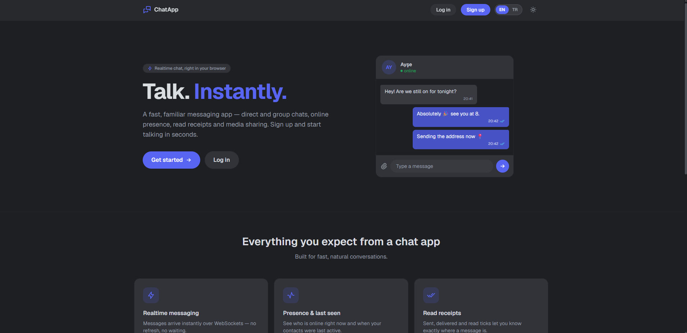
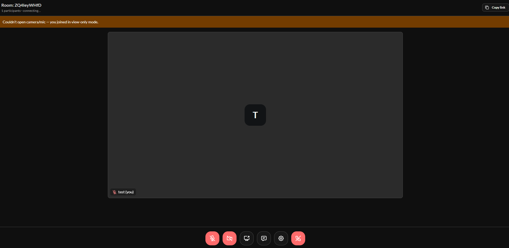
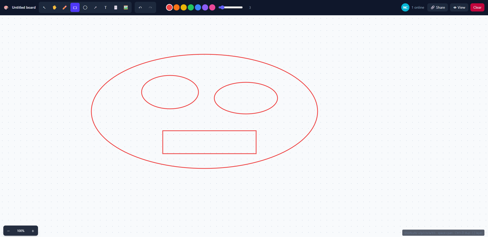
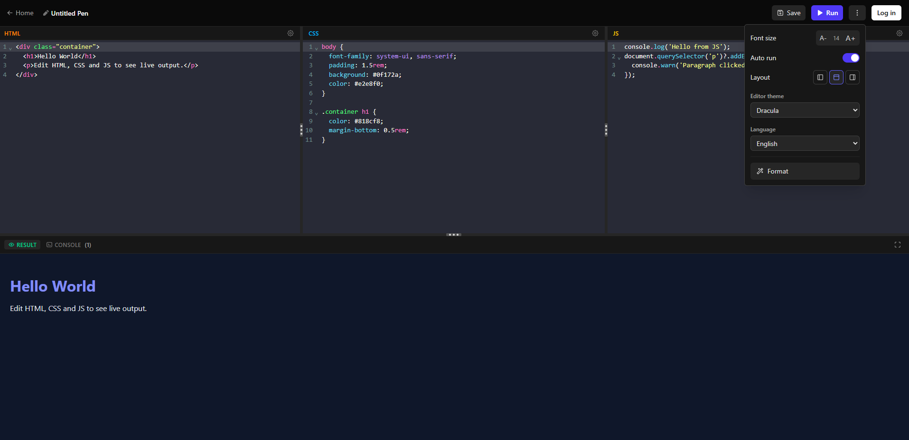
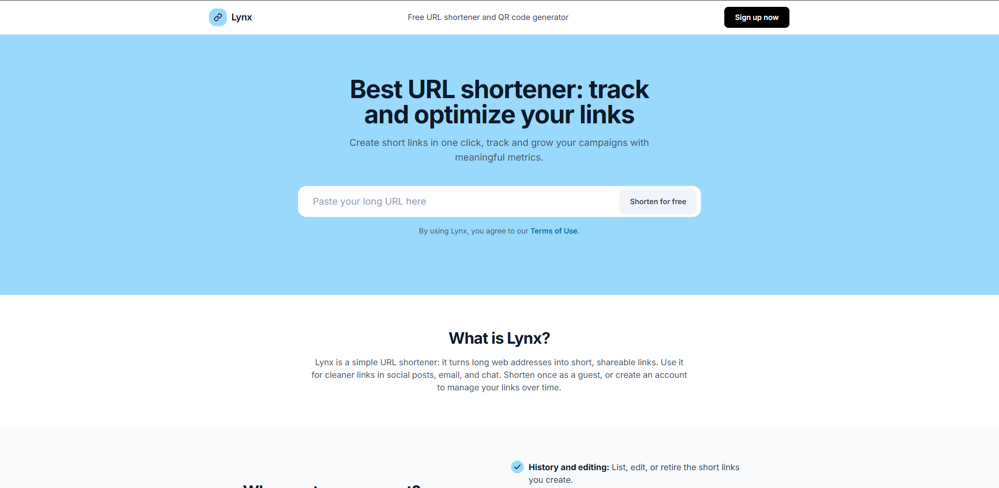
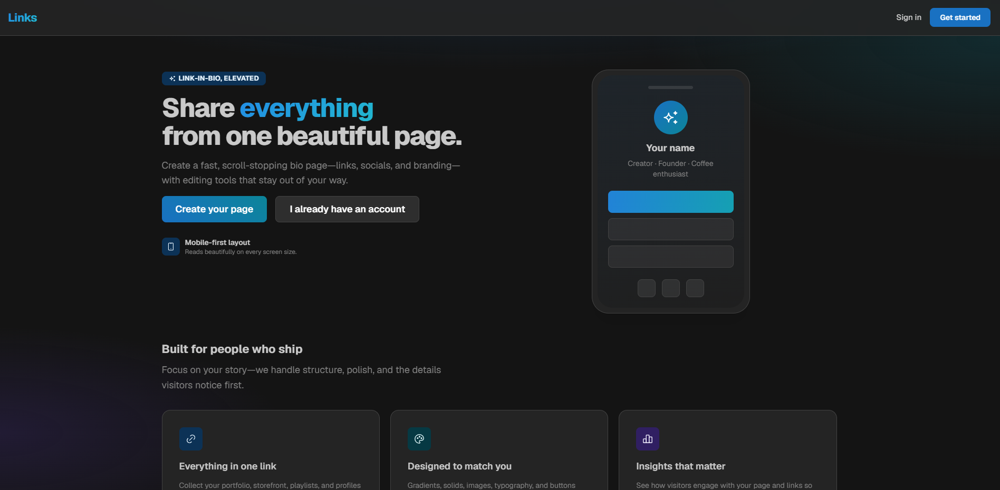
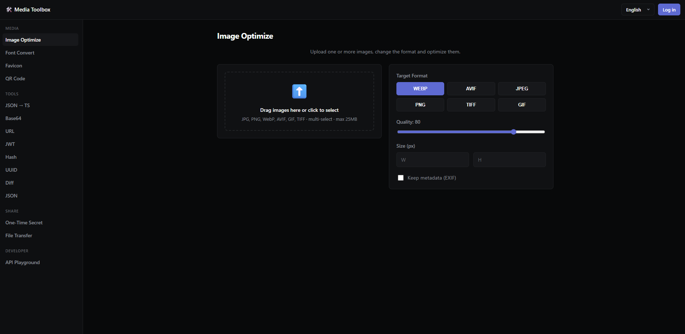
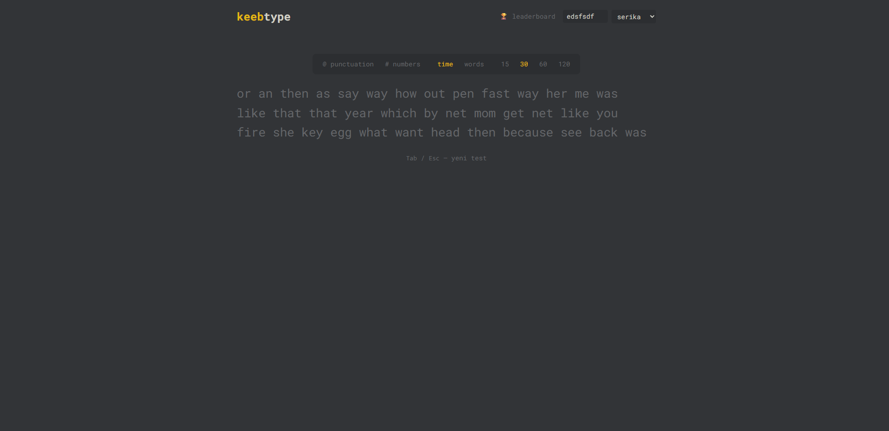
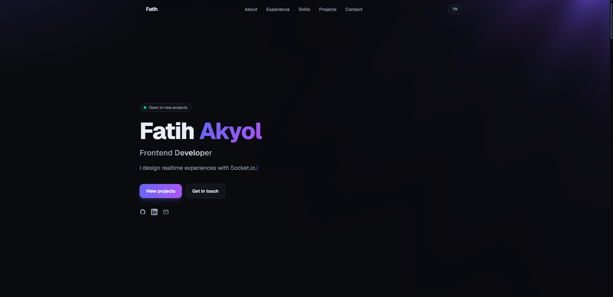

# Fatih Akyol 

**Senior Frontend Developer** · React · Next.js · TypeScript

I build production-grade web applications and ship my own products end to end —
everything below is **live, self-hosted, and open source**.

[**fatihakyol.com**](https://fatihakyol.com) &nbsp;·&nbsp; [**LinkedIn**](https://www.linkedin.com/in/mfatihakyol/) &nbsp;·&nbsp; [**Email**](mailto:muhammedfatihakyol@gmail.com)

---

## 🚀 Live Projects

| Project | What it does | Live Demo | Code |
|---|---|---|---|
| 💬 **Realtime Chat** | Full messaging platform — 1:1 & group chats, read receipts, typing indicators, file sharing, presence | [chat.fatihakyol.com](https://chat.fatihakyol.com) | [repo](https://github.com/mfakyol/chatapp) |
| 📹 **Meet** | Zoom-like video conferencing with mesh WebRTC — media never touches the server | [meet.fatihakyol.com](https://meet.fatihakyol.com) | [repo](https://github.com/mfakyol/meet) |
| 🖊️ **Collab Whiteboard** | Real-time multi-user drawing on an infinite canvas | [draw.fatihakyol.com](https://draw.fatihakyol.com) | [repo](https://github.com/mfakyol/whiteboard) |
| 🧑‍💻 **Code Editor** | CodePen-style in-browser playground with live preview & server-side preprocessor compilation (Sass, Less, Pug…) | [codeeditor.fatihakyol.com](https://codeeditor.fatihakyol.com) | [repo](https://github.com/mfakyol/code-editor) |
| 🔗 **Lynx** | URL shortener with click analytics — charts, world map, GeoIP & device tracking | [lynx.fatihakyol.com](https://lynx.fatihakyol.com) | [repo](https://github.com/mfakyol/lynx) |
| 🌐 **Links** | Linktree-style link-in-bio page builder with drag & drop ordering | [links.fatihakyol.com](https://links.fatihakyol.com) | [repo](https://github.com/mfakyol/links) |
| 🧰 **Toolbox** | Developer utilities — image/font/favicon conversion, one-time secret sharing, file transfer | [toolbox.fatihakyol.com](https://toolbox.fatihakyol.com) | [repo](https://github.com/mfakyol/toolbox) |
| ⌨️ **Typing Test** | Typing speed (WPM) & accuracy test | [typing.fatihakyol.com](https://typing.fatihakyol.com) | [repo](https://github.com/mfakyol/typing) |
| 🎨 **Portfolio** | This all lives somewhere — animated portfolio built with Next.js, Motion & WebGL (OGL) | [fatihakyol.com](https://fatihakyol.com) | [repo](https://github.com/mfakyol/portfolio) |

All projects are deployed by me on Linux with **Docker Compose + nginx**.

<table>
<tr>
<td align="center"><a href="https://chat.fatihakyol.com"> <b>Chat</b></a></td>
<td align="center"><a href="https://meet.fatihakyol.com"> <b>Meet</b></a></td>
<td align="center"><a href="https://draw.fatihakyol.com"> <b>Whiteboard</b></a></td>
</tr>
<tr>
<td align="center"><a href="https://codeeditor.fatihakyol.com"> <b>Code Editor</b></a></td>
<td align="center"><a href="https://lynx.fatihakyol.com"> <b>Lynx</b></a></td>
<td align="center"><a href="https://links.fatihakyol.com"> <b>Links</b></a></td>
</tr>
<tr>
<td align="center"><a href="https://toolbox.fatihakyol.com"> <b>Toolbox</b></a></td>
<td align="center"><a href="https://typing.fatihakyol.com"> <b>Typing</b></a></td>
<td align="center"><a href="https://fatihakyol.com"> <b>Portfolio</b></a></td>
</tr>
</table>

---

## 🛠️ Tech Stack

*plus: Socket.io · WebRTC · Zustand · TanStack Query · Playwright · Three.js*

---

🌱 Currently exploring: **GraphQL** & **React Native**

💼 **Senior Frontend Developer @ Naxxt Software** · 📍 Istanbul, Turkey · Open to new opportunities
